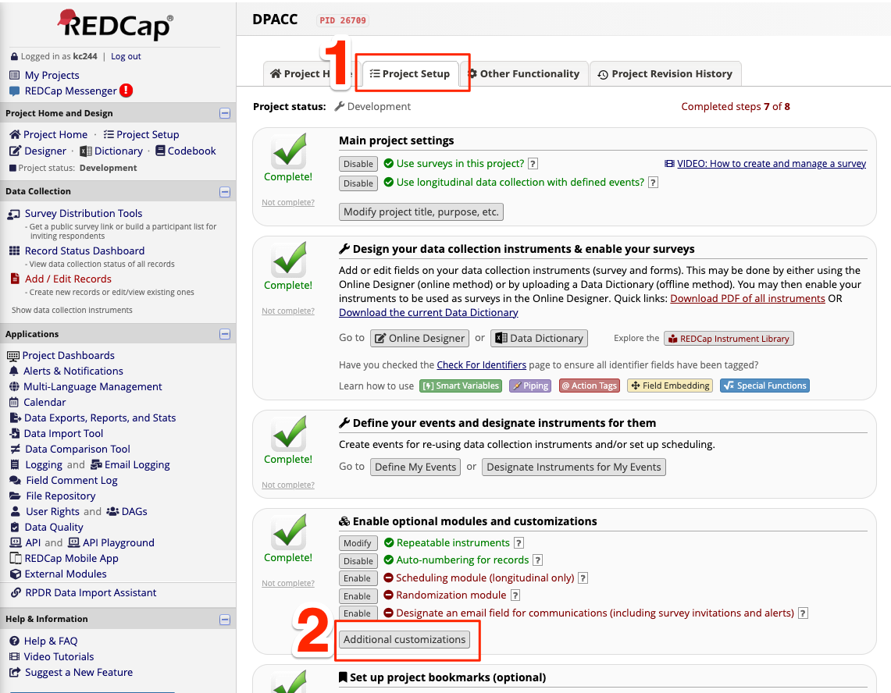
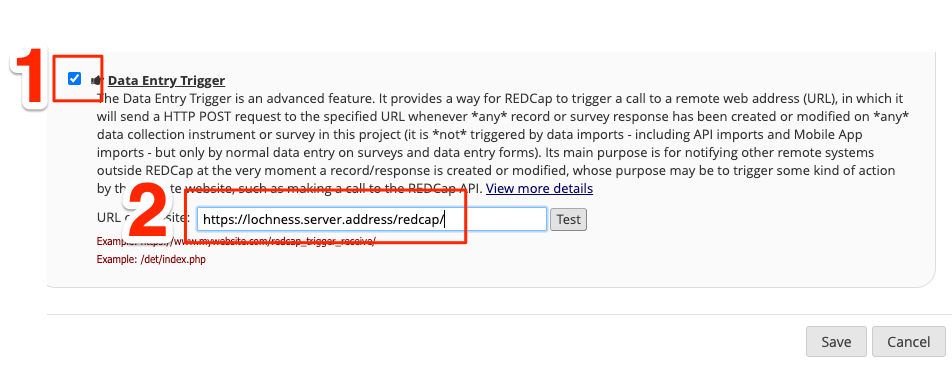
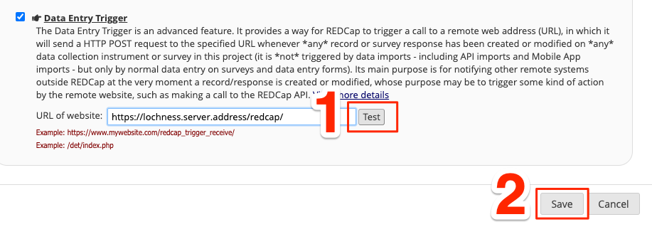

REDCap data entry trigger
~~~~~~~~~~~~~~~~~~~~~~~~~

Unfortunately, REDCap does not support APIs for selectively downloading updated
data. So, if your REDCap server has a limit on how much you can download per 
a given time, you will need to set up "data entry trigger" (DET).

First step: enabling DET on REDCap web settings
"""""""""""""""""""""""""""""""""""""""""""""""

Go to your REDCap project website, then

1. Go to **Project Setup**
2. Go to **Additional customizations** under Enable optional modules and
   customizations

Go to your REDCap project website, then

1. Scroll to the bottom, and enable **Data Entry Trigger** 
2. Provide an address of your server, where you will be running the lochness.
   Make sure your firewall is configured to receive signals from the REDCap
   server. For an example, the REDCap data entry trigger could be configured to
   send the signal to ``https://lochness.server.address/redcap/``

.. note::

   Please note the ``/`` at the end of the address being entered to the data
   entry trigger target.

Second step: set up nginx
""""""""""""""""""""""""""

The ``nginx`` on the server needs be configured to following
(create ssl certificate files and save it under ``/etc/nginx``)

.. code-block:: shell

    server {
        listen 443 ssl;
        server_name lochness.server.address;
	ssl_protocols TLSv1.2 TLSv1.3;
	ssl_certificate lochness.crt;
	ssl_certificate_key lochness.key;

        location /redcap/ {
            proxy_pass http://localhost:8080/;
        }
    }

.. note::

   .. code-block:: shell

       proxy_pass http://localhost:8080/;

   This is directing the signal arriving at ``https://lochness.server.address/redcap/``
   to port 8080. 

   Please note ``/`` at the end of ``/redcap/`` and ``:8080/``

Third step: run command to listen to the signal
"""""""""""""""""""""""""""""""""""""""""""""""

Run the command below (and keep it running) to listen to any data entry
trigger. 

.. code-block:: shell

    listen_to_redcap.py \
        --database_csv /data/pronet/data_sync_pronet/data_entry_trigger_database.csv \
        --port 8080

.. note::

   This command will listen to port 8080 and save database to
   `data_entry_trigger_database.csv` file, which will be used by lochness to
   determine if the REDCap data should be downloaded for the individual or not.
   (Therefore, you will need to run this command on the server that is running
   lochness)

1. Try pressing "Test" button on the data entry trigger page on the REDCap
   website, and make sure the console of ``listen_to_redcap.py`` printing out
   some lines whenever you press the "Test button"

2. Save the settings.

.. note::

   Try modifying a data field, and see if your ``data_entry_trigger_database.csv``
   saves this change correctly.

Last step: update your configuration file
"""""""""""""""""""""""""""""""""""""""""
Your lochness configuration file should include the path of the
``data_entry_trigger_database.csv``. See example below.

.. code-block:: shell

    AWS_BUCKET_NAME: pronet-test
    AWS_BUCKET_ROOT: TEST_PHOENIX_ROOT_PRONET_PROD
    s3_selective_sync: [surveys,mri,phone,eeg,actigraphy]
    redcap:
        PronetLA:
            deidentify: True
            data_entry_trigger_csv: /data/pronet/data_sync_pronet/data_entry_trigger_database.csv
            update_metadata: True
        PronetOR:
            deidentify: True
            data_entry_trigger_csv: /data/pronet/data_sync_pronet/data_entry_trigger_database.csv
            update_metadata: True
        ...

If you have more than one REDCap server sending the data entry trigger signal,
``nginx`` and ``listen_to_redcap.py`` need to be configured accordingly.
