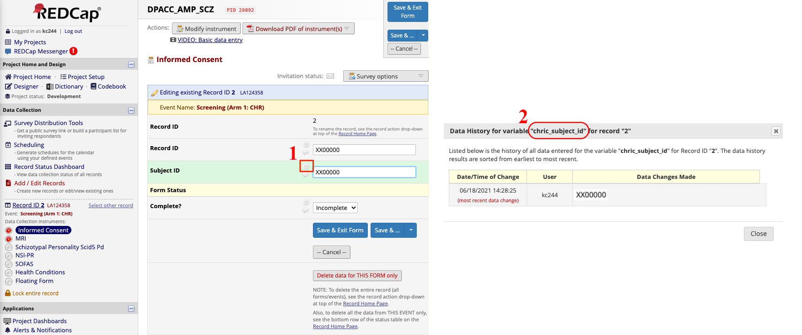

Data sources
============
Lochness supports pulling data from a number of data sources. This page will 
show you how to configure these data sources both in the source, keyring, 
and configuration file. 

As a reminder, to have AMPSCZ-Lochness download any data from given sources,
it requires either REDCap or RPMS linked to Lochness. Lochness loads list of
unique IDs from the chosen database, as well as the corresponding mindlamp IDs
for each subject.

AMP-SCZ subject ID follow the pattern of ``XX00000``, where

* The first two capital letters represent unique site.
* The five unique digits for each subject.

REDCap
------

REDCap project settings
~~~~~~~~~~~~~~~~~~~~~~~
On the REDCap project, the following fields are required.

- ID
- Date of consent
- Mediaflux ID

You need to have the exact the name of each field, which you can find out by
clinking 'H' button next to the field on the dictionary view page.

Also, REDCap data entry trigger should be enabled to send a POST signal to the
same server hosting AMP-SCZ Lochness. This server should have a open port
available to listen to the POST signal from REDCap. Tick the box under 
"Project Setup" >> "Additional customizations" >> "Data Entry Trigger" and give
it a address:port to the "URL of website" ::

    https://<IP address of the data aggregate server>:9999

REDCap De-identification
~~~~~~~~~~~~~~~~~~~~~~~~
For each PHOENIX study, you may add an entry to the Lochness configuration 
file indicating that data from REDCap should be *de-identified* before being
saved to the filesystem. Please refer to the 
`redcap configuration file documentation <configuration_file.html#redcap>`_  
for more details.

REDCap keyring settings
~~~~~~~~~~~~~~~~~~~~~~~
First you need to create a section at the root of your ``keyring`` for your 
REDCap connection details. You can name this section whatever you like as 
long as it is valid JSON. Within this section you'll need to add a ``URL`` 
field and a subsection named ``API_TOKEN`` where you will store all of your 
REDCap Project API tokens. There are two parts required for the REDCap.

Part 1 at the top will link each site to ``redcap.Pronet`` credentials ::

    {"lochness" : 
        {"REDCAP": 
            {"PronetXX": {"redcap.Pronet": [ "Pronet" ]},
             "PronetAA": {"redcap.Pronet": [ "Pronet" ]}}
         }
     }

Part 2 will have the actual credentials of the ``redcap.Pronet`` REDCap
project ::

    {"redcap.Pronet": 
        {"URL": "https://redcapynh-p11.ynhh.org",
         "API_TOKEN": {"Pronet": "EAXBWERAAWETYZXCGOAWERY"}}
    }

.. note::
   To generate a REDCap Project API Token, use the ``API`` section under your
   REDCap Project Settings page.

REDCap settings in the configuration file
~~~~~~~~~~~~~~~~~~~~~~~~~~~~~~~~~~~~~~~~~

::

    pii_table: {args.pii_csv}
    lochness_sync_history_csv: {args.lochness_sync_history_csv}
    redcap_id_colname: chric_record_id
    redcap_consent_colname: chric_consent_date

    redcap:
        PronetXX:
            deidentify: True
            data_entry_trigger_csv: {args.det_csv}
            update_metadata: True
        PronetAA:
            deidentify: True
            data_entry_trigger_csv: {args.det_csv}
            update_metadata: True

Location of table to be used in deidentifying redcap fields
Lochness sync history database csv path
Redcap data entry trigger database csv path

RPMS
----
To have Lochness download data automatically from RPMS, you need a few
things.

Get RPMS_PATH
~~~~~~~~~~~~~
Since RPMS exports data into a directory daily, you will need to provide this
RPMS data export path.

Create keyring section
~~~~~~~~~~~~~~~~~~~~~~
Next, you need to create a new ``keyring`` section for your RPMS instance. 
This section must be named ``rpms.xxxxx`` where ``xxxxx`` can be any 
string that is both valid JSON *and* match `rpms` column values in the
metadata.csv. 
Within your new section, you must add your RPMS RPMS_PATH ::

    {
      "rpms.xxxxx": {
        "RPMS_PATH": "..."
        }
    }

XNAT
----
For each XNAT instance you wish to pull data from, add a new connection 
details section to the root of your ``keyring``. The name of this section 
can be whatever you like as long as it's valid JSON. Within your new section, 
add the ``URL``, ``USERNAME``, and ``PASSWORD`` fields ::

    {
      "xnat.example": {
        "URL": "https://xnat.example.org",
        "USERNAME": "...",
        "PASSWORD": "..."
      }
    }

metadata file entry
~~~~~~~~~~~~~~~~~~~
A valid metadata file entry should look as follows ::

    Active,...,XNAT,...
    1,...,xnat.example:PROJECT:SUBJECT,...

Where ``xnat.example`` would be a valid ``keyring`` section, ``PROJECT`` would 
be a valid XNAT project, and ``SUBJECT`` would be a valid XNAT Subject.

.. attention::
   The ``SUBJECT`` component of this metadata entry should be a valid XNAT 
   Subject, not just a MR Session. All MR Sessions for that XNAT Subject 
   will be downloaded. 

Box
---
To have Lochness download data automatically from Box, you need a few
things.

create access token
~~~~~~~~~~~~~~~~~~~
First, you need to get CLIENT_ID, CLIENT_SECRET and API Access Token from the 
app created on the `https://app.box.com/developers/console`. The token should be a
32-character alphanumeric string.

create keyring section
~~~~~~~~~~~~~~~~~~~~~~
Next, you need to create a new ``keyring`` section for your Box instance. 
This section must be named ``box.xxxxx`` where ``xxxxx`` can be any 
string that is both valid JSON *and* match `box` column values in the
metadata.csv. 
Behind the scenes, Lochness will use this string to import a module from 
`lochness.box`. Within your new section, you must add your Box CLIENT_ID,
CLIENT_SECRET and API_TOKEN  ::

    {
      "box.xxxxx": {
        "CLIENT_ID": "...",
        "CLIENT_SECRET": "...",
        "API_TOKEN": "..."
        }
    }

metadata file entry
~~~~~~~~~~~~~~~~~~~
A valid metadata file entry should look as follows ::

    Active,...,Box,...
    1,...,box.xxxxx:SUBJECT,...

Where ``box.xxxxx`` would be a valid ``keyring`` section and ``SUBJECT`` 
would be a valid Subject folder name in Box. This folder name does not 
necessarily have to match the PHOENIX subject.

delete on success
~~~~~~~~~~~~~~~~~
You can configure Lochness to delete files from Box on successful download. 
For details, please refer to the 
`box delete_on_success configuration file documentation <configuration_file.html#delete-on-success>`_

box base
~~~~~~~~
You can configure Lochness to begin searching your Box account starting from 
a specific subdirectory. For details, please refer to the
`box base configuration file documentation <configuration_file.html#box-base>`_.

Mediaflux
---------
A standalone documentation for the interaction between Mediaflux and lochness is available `here <./mediaflux.md>`_.
Specifically, you can take a look at `mediaflux#keyring-file <./mediaflux.md#keyring-file>`_ and
`mediaflux#metadata-file <./mediaflux.md#metadata-file>`_. Learn about login credentials necessary for the keyring file
from `https://wiki-rcs.unimelb.edu.au/display/RCS/Configuration+File <https://wiki-rcs.unimelb.edu.au/display/RCS/Configuration+File>`_.
You may authenticate with Mediaflux using your credentials or a secure token as mentioned in the above Wiki.

Mindlamp
--------
To have Lochness download data automatically from Mindlamp, you need a few
things.

Get URL, access key and secret key
~~~~~~~~~~~~~~~~~~~~~~~~~~~~~~~~~~
First, you need to get URL, ACCESS_KEY and SECRET_KEY from the mindlamp.

Create keyring section
~~~~~~~~~~~~~~~~~~~~~~
Next, you need to create a new ``keyring`` section for your Mindlamp instance. 
This section must be named ``mindlamp.xxxxx`` where ``xxxxx`` can be any 
string that is both valid JSON *and* match `mindlamp` column values in the
metadata.csv. 
Within your new section, you must add your Mindlamp URL, ACCESS_KEY and
SECRET_KEY  ::

    {
      "mindlamp.xxxxx": {
        "URL": "...",
        "ACCESS_KEY": "...",
        "SECRET_KEY": "..."
        }
    }

metadata file entry
~~~~~~~~~~~~~~~~~~~
A valid metadata file entry should look as follows ::

    Active,...,Mindlamp,...
    1,...,mindlamp.xxxxx:SUBJECT,...

Where ``mindlamp.xxxxx`` would be a valid ``keyring`` section and ``SUBJECT`` 
would be a valid Subject folder name in Mindlamp. This folder name does not 
necessarily have to match the PHOENIX subject.
